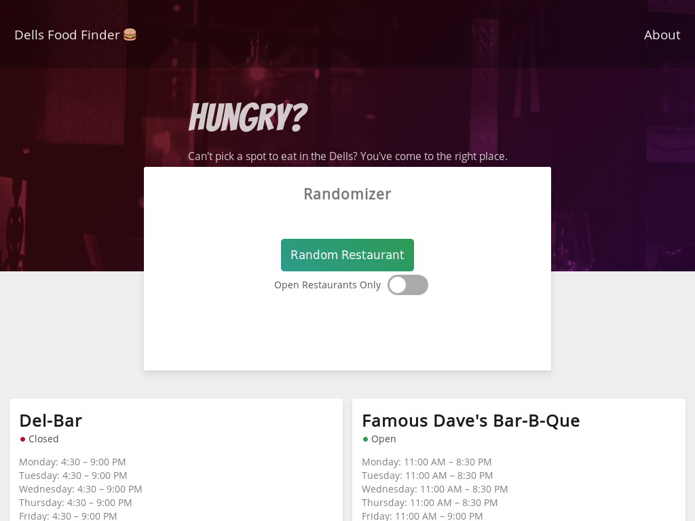

The back and forth involved in picking a restaurant to visit can be frustrating. That's why I made Dellish.

Dellish pulls in a list of restaurants in Wisconsin Dells, along with contact information, open hours, etc. It displays this information to the user and offers to pick one for them. 

Pulling in data from the Google Places API was the most challenging (and awesome) part of this project. I needed a database due to the way the API serves its data. 20 results are returned per query, with a key to access the next page of 20 (60 total is the limit). Three requests are needed to get all of the data; that's a performance problem in itself. What makes it worse is that there is a delay between the first request and the availability of the next page of results&mdash;about 1-2 seconds. Taking 4 seconds beyond the initial page load to populate the data was not going to fly. So I cached it, leaving the user's connection speed as the primary, potential bottleneck. Sqlite was chosen because of Dellish's small storage and access requirements.

Making a backend talk to a frontend, working with an API, and managing a database made building Dellish a lot of fun.
