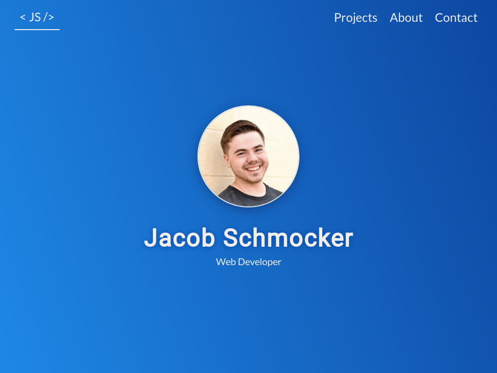

jacobschmocker.com was the first version of my website. I had just started learning web development, and decided that I needed to put myself out there.
I made the site with the usual three technologies: HTML, CSS, and vanilla JavaScript. 

## A Little Style
Styling it was a challenge. It was excellent practice for a lot of concepts: (responsive) design, browser differences, flexbox, etc. If I were to go back and change anything, I would use a more consistent naming convention like BEM. I might also have used a CSS preprossor like SASS.

## JS
With jacobschmocker.com being a static site, the JavaScript is minimal. One event listener manages the navigation bar styling at different scroll locations. Another adjusts section heights on resize. 

I built a backend for the contact form using Node.js and the Telegram API.
You can find its code [here](https://github.com/theschmocker/buzzer).

## Deployment

Though I'd been using GNU/Linux for years, hosting this website was my first time administering a real server. After a couple days of research and tinkering, I had set up an Ubuntu VPS with Apache, a Let's Encrypt certificate, and a means of deployment using Git webhooks. 

Requests to the backend contact server are routed through a reverse proxy on the same server.
