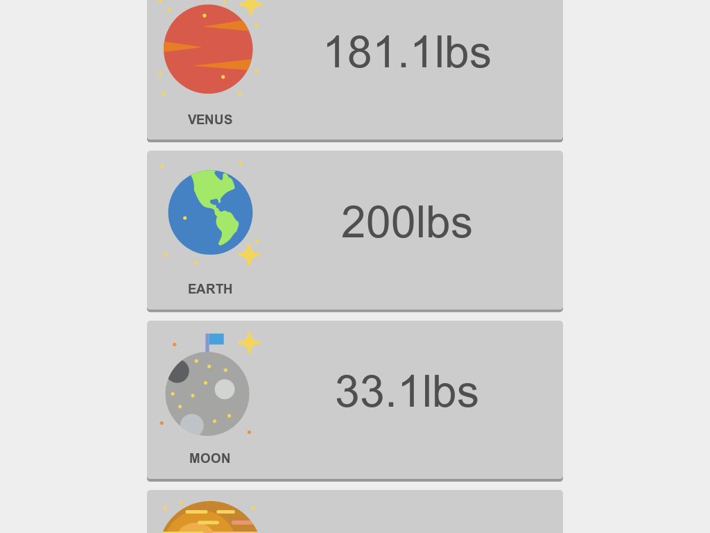

"Planetary Weights" is a bit of a misnomer. It doesn't tell you the weight of any planet. Rather, it tells you *your* weight on the major celestial objects of our solar system.

This project was inspired by an astronomy course I took. Each student calculated their relative weight on each major celestial body, from the Sun to Pluto. By hand. In the absence of a lab, one night, I put this together! What took 15 minutes before now takes less than one second. The wonders of automation. I jest.

Being such a small project, I decided to go with Preact. Though Preact comes in at a much lower weight than React, it shares a lot of the larger framework's niceties: JSX, components, virtual DOM, etc. It was a pleasure to work with, made getting started painless, and has great performance.
