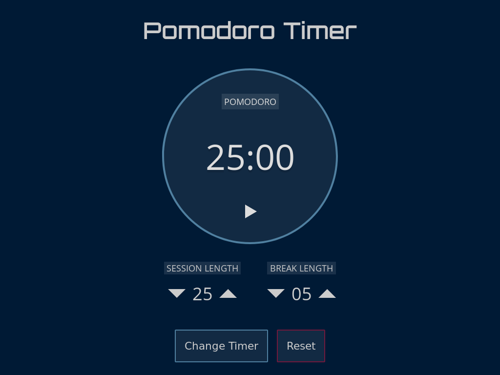

Once upon a time, I stumbled upon the Pomodoro technique. Then I used it to build my own Pomodoro timer. There are great timers already out there, but I wanted to build my own.

Pomtime is a Progressive Web App, so it can be installed as an app on a user's phone and used offline. It also saves a user's timer settings to localStorage.

To switch back and forth between the main and break timers, I used the "state pattern". The main timer object controls two smaller objects that represent different timer states. The controller object switches between them when a timer ends or a user clicks "Change Timer".

Observables hand the timer settings. When a timer's duration is changed, it updates both the timer and the setting in localStorage.

Webpack bundles and minifies the code for smaller file sizes and faster load times. This was my first time setting up a custom Webpack configuration.
